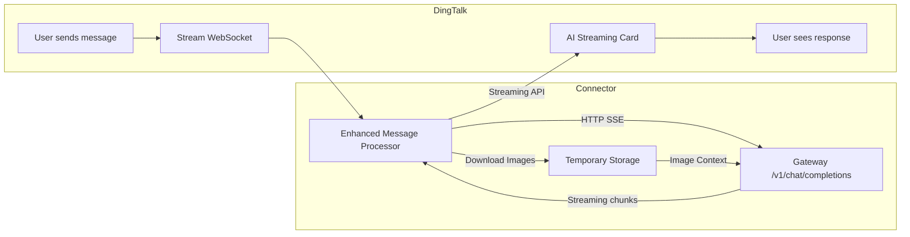

# DingTalk OpenClaw Connector

**Enhanced DingTalk Channel Plugin for OpenClaw with Rich Media Support**

This plugin extends the original `dingtalk-moltbot-connector` with enhanced image processing capabilities, enabling seamless handling of rich text messages and picture messages from DingTalk.

## 🚀 Key Features

### Enhanced Media Support ✨
- **Rich Text Message Processing**: Automatically downloads and processes images embedded in rich text messages
- **Picture Message Support**: Handles standalone picture messages with automatic download and integration
- **Temporary File Management**: Automatically creates and manages temporary directories for downloaded images
- **AI Integration**: Seamlessly integrates downloaded images into AI context for multimodal processing

### Core Capabilities
- ✅ **AI Card Streaming**: Real-time streaming responses with typewriter effect
- ✅ **Session Persistence**: Multi-turn conversations with shared context
- ✅ **Timeout Management**: Automatic new session after 30 minutes of inactivity
- ✅ **Manual Session Reset**: Send `/new` or `新会话` to clear conversation history
- ✅ **Image Auto-upload**: Local image paths automatically uploaded to DingTalk
- ✅ **Proactive Messaging**: Send messages to DingTalk users or groups proactively

## 🏗️ Architecture



## 📸 Enhanced Image Processing Workflow

1. **Message Reception**: Receive rich text or picture messages from DingTalk
2. **Image Detection**: Identify download codes for embedded images
3. **Automatic Download**: Download images using DingTalk API with retry logic (max 3 attempts)
4. **Temporary Storage**: Save images to `~/tmp/dingtalk-images/` directory
5. **AI Context Integration**: Include local image paths in user content for AI processing
6. **Cleanup**: Automatic cleanup of temporary files

## 🎯 Usage Examples

### Rich Text Messages with Images
When a user sends a rich text message containing both text and images:
- The plugin automatically downloads all images
- Images are saved to temporary storage
- Both text and image paths are sent to the AI model
- AI can process both textual and visual content

### Picture Messages
When a user sends a standalone picture message:
- The image is automatically downloaded
- The AI receives the image path for processing
- AI can analyze and respond to the image content

### Manual Image References
Users can also reference local images directly:
```markdown


```

## 🛠️ Installation

### 1. Install Plugin

```bash
# Install via npm (recommended)
openclaw plugins install @dingtalk-real-ai/dingtalk-connector

# Or install via Git
openclaw plugins install https://github.com/Chengzheqiao/dingtalk-openclaw-connector.git

# Upgrade plugin
openclaw plugins update dingtalk-connector

# Or local development mode
git clone https://github.com/Chengzheqiao/dingtalk-openclaw-connector.git
cd dingtalk-openclaw-connector
npm install
openclaw plugins install -l .
```

### 2. Configuration

Add to `~/.openclaw/openclaw.json`:

```json5
{
  "channels": {
    "dingtalk-connector": {
      "enabled": true,
      "clientId": "dingxxxxxxxxx",       // DingTalk AppKey
      "clientSecret": "your_secret_here", // DingTalk AppSecret
      "gatewayToken": "",                 // Optional: Gateway auth token
      "gatewayPassword": "",              // Optional: Gateway auth password (alternative to token)
      "sessionTimeout": 1800000,          // Optional: Session timeout in ms (default 30 minutes)
      "enableMediaUpload": true           // Enable media upload prompt injection (default true)
    }
  },
  "gateway": {
    "http": {
      "endpoints": {
        "chatCompletions": {
          "enabled": true
        }
      }
    }
  }
}
```

### 3. Restart Gateway

```bash
openclaw gateway restart
```

Verification:
```bash
openclaw plugins list  # Confirm dingtalk-connector is loaded
```

## 🤖 Creating DingTalk Bot

1. Go to [DingTalk Open Platform](https://open.dingtalk.com/)
2. Navigate to **App Development** → **Enterprise Internal Development** → Create App
3. Add **Bot** capability, select **Stream Mode** for message reception
4. Enable permissions:
   - `Card.Streaming.Write`
   - `Card.Instance.Write`
   - `qyapi_robot_sendmsg`
5. **Publish the app** and record **AppKey** and **AppSecret**

## ⚙️ Configuration Reference

| Configuration | Environment Variable | Description |
|---------------|---------------------|-------------|
| `clientId` | `DINGTALK_CLIENT_ID` | DingTalk AppKey |
| `clientSecret` | `DINGTALK_CLIENT_SECRET` | DingTalk AppSecret |
| `gatewayToken` | `OPENCLAW_GATEWAY_TOKEN` | Gateway auth token (optional) |
| `gatewayPassword` | — | Gateway auth password (optional, alternative to token) |
| `sessionTimeout` | — | Session timeout in milliseconds (default 1800000 = 30 minutes) |
| `enableMediaUpload` | — | Enable media upload prompt injection (default true) |

## 💬 Session Commands

Users can send the following commands to start a new session (clear conversation history):

- `/new`, `/reset`, `/clear`
- `新会话`, `重新开始`, `清空对话`

## 📁 Project Structure

```
dingtalk-openclaw-connector/
├── plugin.ts              # Plugin entry point with enhanced image support
├── openclaw.plugin.json   # Plugin manifest
├── package.json           # npm dependencies
├── README.md             # This enhanced documentation
└── LICENSE               # MIT License
```

## ❓ Common Issues

### Q: 405 Error Appears

Ensure `chatCompletions` endpoint is enabled in `~/.openclaw/openclaw.json`:

```json5
{
  "gateway": {
    "http": {
      "endpoints": {
        "chatCompletions": {
          "enabled": true
        }
      }
    }
  }
}
```

### Q: 401 Error Appears

Verify the gateway.auth token/password in `~/.openclaw/openclaw.json` is correct.

### Q: DingTalk Bot Not Responding

1. Confirm Gateway is running: `curl http://127.0.0.1:18789/health`
2. Confirm bot is configured as **Stream Mode** (not Webhook)
3. Confirm AppKey/AppSecret are correct

### Q: AI Card Not Displaying, Only Plain Text

Enable permissions `Card.Streaming.Write` and `Card.Instance.Write`, then republish the app.

### Q: Images Not Displaying

1. Confirm `enableMediaUpload: true` (enabled by default)
2. Check logs for `[DingTalk][Media]` related output
3. Confirm DingTalk app has image upload permissions

### Q: Image Download Failures

The enhanced plugin includes retry logic (3 attempts) for image downloads. Check:
1. Network connectivity to DingTalk API
2. App permissions for file access
3. Temporary directory write permissions

## 📦 Dependencies

| Package | Purpose |
|---------|---------|
| `dingtalk-stream` | DingTalk Stream protocol client |
| `axios` | HTTP client |
| `form-data` | Form data handling for file uploads |
| `fluent-ffmpeg` | Video metadata extraction and thumbnail generation |
| `@ffmpeg-installer/ffmpeg` | FFmpeg binary for video processing |

## 🔄 Enhanced vs Original

This fork enhances the original `dingtalk-moltbot-connector` with:

1. **`downloadDingTalkImage` function**: Downloads images from DingTalk API with retry logic
2. **Enhanced `extractMessageContent`**: Processes rich text and picture messages
3. **Temporary file management**: Automatic creation and cleanup of image storage
4. **Error handling**: Comprehensive error handling and logging
5. **AI context integration**: Seamless integration of downloaded images into AI processing

## 🤝 Contributing

Contributions are welcome! Please follow these guidelines:

1. Fork the repository
2. Create your feature branch (`git checkout -b feature/AmazingFeature`)
3. Commit your changes (`git commit -m 'Add some AmazingFeature'`)
4. Push to the branch (`git push origin feature/AmazingFeature`)
5. Open a Pull Request

## 📜 License

[MIT](LICENSE)

---

**Note**: This enhanced version maintains full compatibility with the original plugin while adding rich media support capabilities.